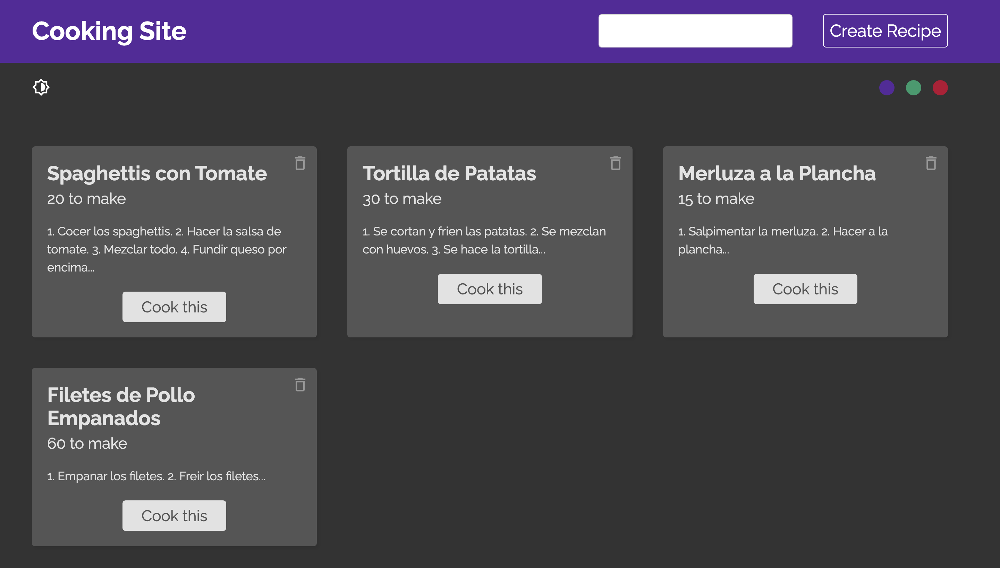

# React_Cooking

Repository created following this [Udemy Course](https://www.udemy.com/course/build-web-apps-with-react-firebase/) to practice the following React concepts:

- Context
- Reducers
- Custom hooks
- Firebase

## Application

The applcation is basically a CRUD of recipes using Firebase capabilities. User can also switch navbar color & mode by cliking on the icons.



## Run Locally

Clone the project

```bash
  git clone https://github.com/pedrolopezbiedma/React_Cooking.git
```

Install dependencies

```bash
  npm install
```

Set up Firebase connection.

- Create a firebase project.
- For the project, initialize a firestore database.
- Create a web app for the project.
- Grab the project config and set it up into the firebase folder within the local project

Start the application

```bash
  npm run start
```

## Authors

- [@pedrolopezbiedma](https://github.com/pedrolopezbiedma)
